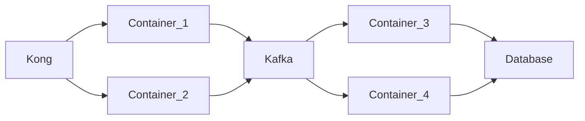

## Challenge

- 1M rows with les than 200ms with p99

## Proposal

```mermaid
graph LR;
    Kong --> Container_1 & Container_2
    Container_1 & Container_2 --> Kafka
    Kafka --> Container_3 & Container_4
    Container_3 & Container_4 --> Database
```