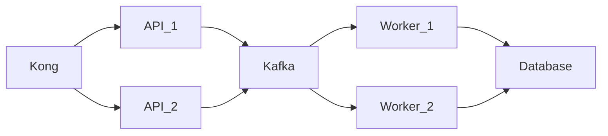

## Challenge

- 1M rows with less than 200ms with p99

## Proposal

SURVEY
│── cmd
│   ├── api
│   │   └── main.go
│   ├── worker
│   │   └── main.go
│
│── docker
│   ├── api
│   │   └── Dockerfile
│   ├── worker
│   │   ├── Dockerfile
│   ├── docker-compose.yaml
│   ├── seeds.sql
│
│── internal
│   ├── consumer
│   ├── database
│   ├── entities
│   ├── handlers
│   ├── processor
│   ├── publisher
│   ├── repository
│   ├── use_cases
│
│── go.mod
│── go.sum
│── README.md